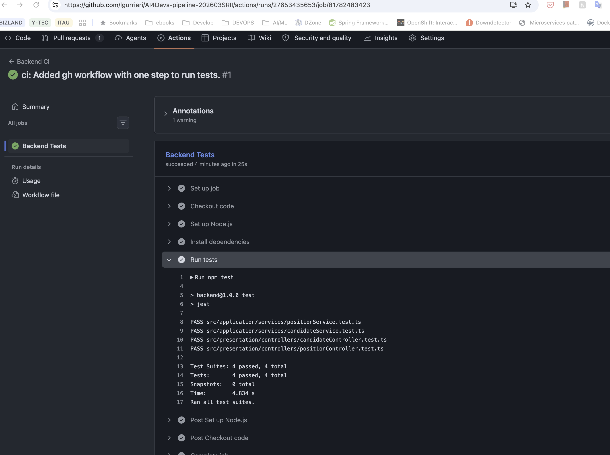
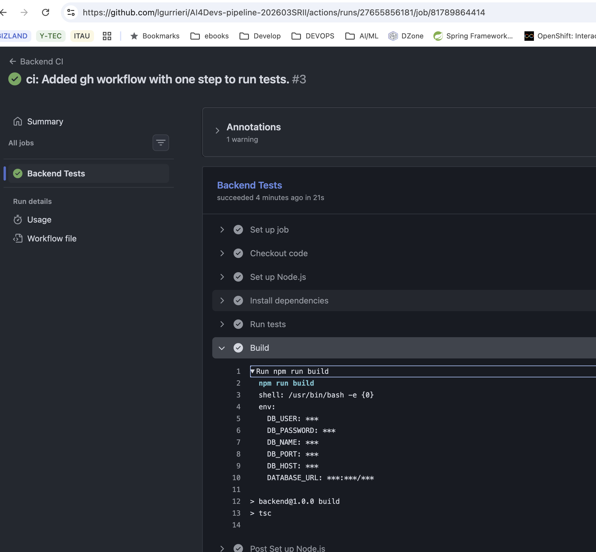

# Tools 
**IDE**: VSCode with Github Copilot

**Model**: Claude Sonnet 4.6 

# Prompting

## Prompt 1:
Create a basic GitHub Actions workflow that runs backend tests anytime an open Pull Request is on any branch. 

## Prompt 2:
After 'Run tests' add another step to build backend project. 
Discard .env file values and use the ones created using the same keys in GitHub secrets. 

## Prompt 3: 
Change the DATABASE_URL, avoiding a new secret by concatenating the existing secrets.

## Prompt 4: 
Fix DATABASE_URL adding DB_HOST secret definition.

