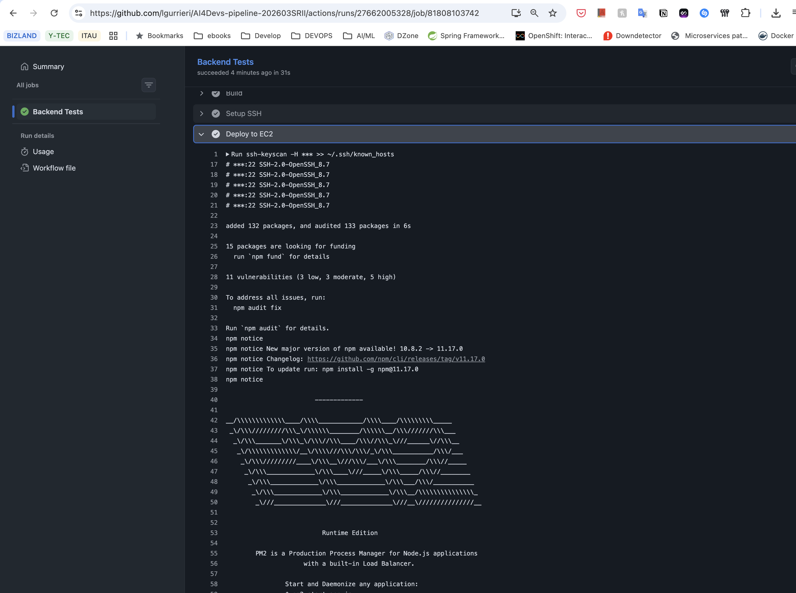
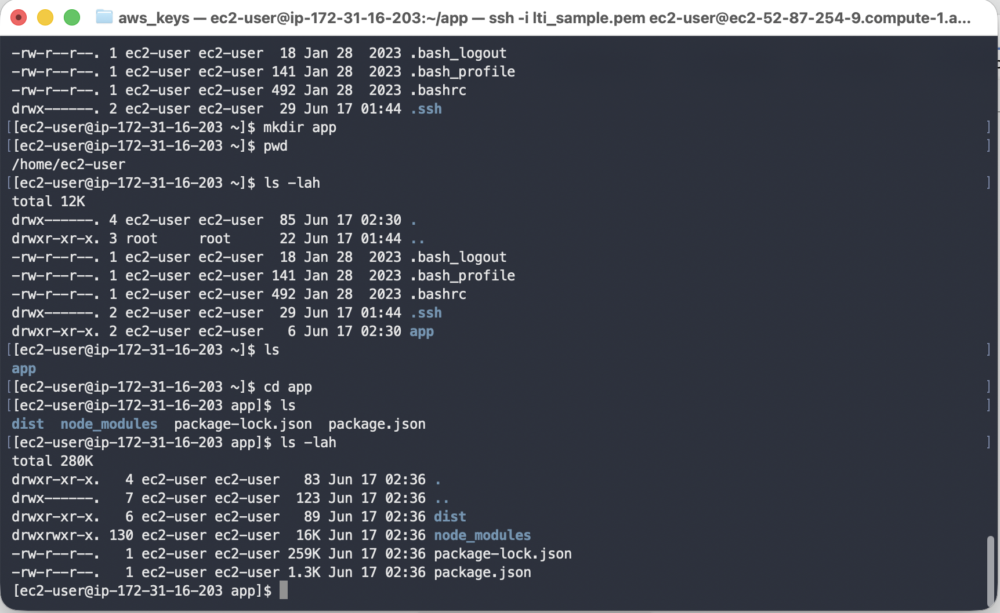

# Tools 
**IDE**: VSCode with Github Copilot

**Model**: Claude Sonnet 4.6 

# Prompting

## Prompt 1:
Create a basic GitHub Actions workflow that runs backend tests anytime an open Pull Request is on any branch. 

## Prompt 2:
After 'Run tests' add another step to build backend project. 
Discard .env file values and use the ones created using the same keys in GitHub secrets. 

## Prompt 3: 
Change the DATABASE_URL, avoiding a new secret by concatenating the existing secrets.

## Prompt 4: 
Fix DATABASE_URL adding DB_HOST secret definition.

## Prompt 5: 
Evolve this Github workflow adding a last step to deploy de backend build in an EC2 instance. Check the secrets defined in GitHub Repo for AWS and EC2 instance. Don't guess and, if you are no sure about something, just ask me.

